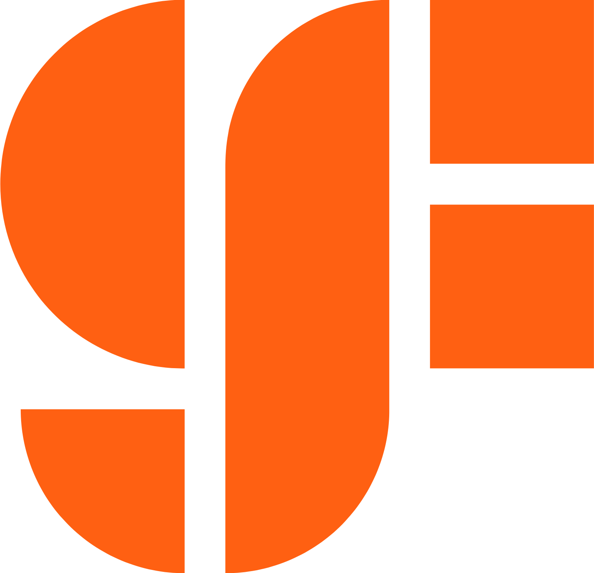

GlobalFoundries (GF) ist eines der weltweit führenden Unternehmen der Halbleiterindustrie und produziert moderne Mikrochips. Die Chips von GF stecken unter anderem in Smartphones, Autos, Kommunikationssystemen sowie Industrieanlagen. Mit Standorten in Europa, den USA und Asien gehört das Unternehmen zu den wichtigsten Technologiepartnern vieler internationaler Firmen.

Neben technologischer Innovation engagiert sich GlobalFoundries auch sozial. Über das Programm „GlobalGives“ unterstützt das Unternehmen weltweit gemeinnützige Organisationen und soziale Projekte. Mitarbeitende können Geld spenden oder sich ehrenamtlich engagieren, wobei viele Spenden zusätzlich durch GlobalFoundries verdoppelt werden. Unterstützt werden unter anderem Bildungsprojekte, Umweltaktionen sowie soziale Einrichtungen und damit auch unser Förderverein. 

Wir freuen uns, nun endlich bei bei Benevity.com registriert und gelistet zu sein. Dies bedeutet für alle GlobalFoundries Mitarbeiter, wenn Sie spenden, verdoppelt GlobalFoundries eure Spende z.B. Sie spenden 20 Euro, bei uns kommen 40 Euro an. Die ersten 150 Euro sind sogar schon auf unserem Benevity Konto eingegangen. Wie funktioniert das: Am besten an einem Arbeitsrechner einloggen unter: https://globalgives.benevity.org nach Melli-Beese suchen. Auswählen-Button „Donate Now“ blau hinterlegt drücken und dann nur noch die Zahlmethode wählen.

Weitere Informationen zum Programm findet ihr auf der Website von [GlobalFoundaries](https://gf.com/de/careers/life-at-gf/globalgives/).

